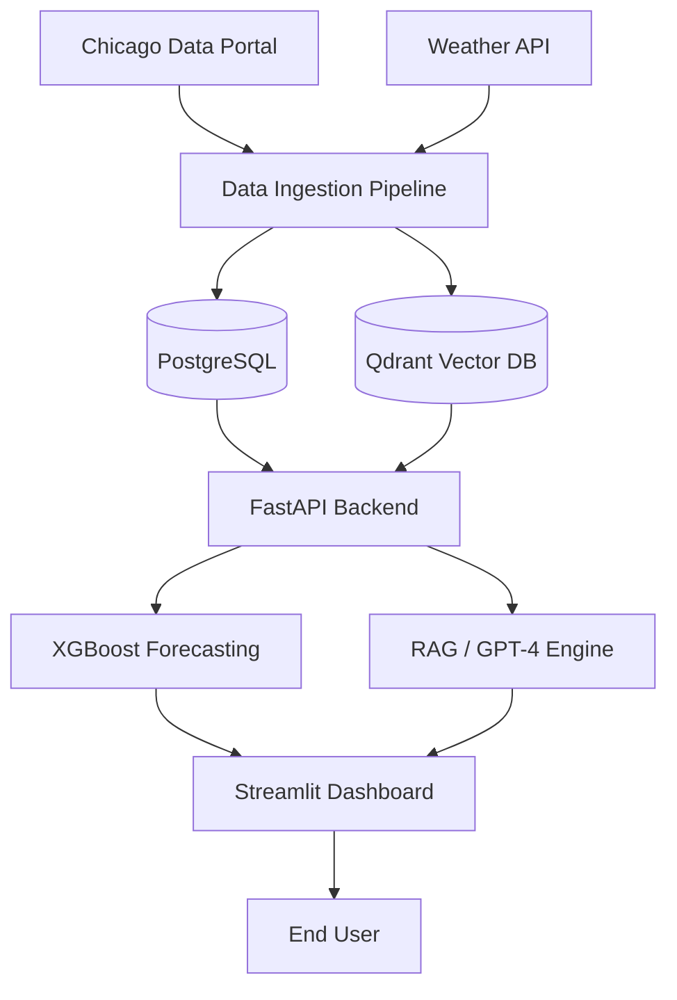

# Urban Traffic Intelligence Platform 🏙️🚦

## 📖 Introduction: What is this Project?
The **Urban Traffic Intelligence Platform** is a state-of-the-art AI-powered system designed to analyze, monitor, and predict traffic dynamics for the city of Chicago. 

By fusing real-time city data with advanced Machine Learning (XGBoost) and Natural Language Processing (LLMs + RAG), this platform transforms raw traffic sensor data and incident reports into actionable urban intelligence.

## 🎯 The Purpose & Problem Solved
Chicago consistently ranks among the most congested cities in the world. This project solves three key challenges:
1.  **Information Fragmentation**: It aggregates traffic speeds, crash reports, road construction, and weather data into a single source of truth.
2.  **Lack of Predictive Insight**: Instead of just showing "current" traffic, it provides high-precision **24-hour forecasts** for specific road segments.
3.  **Complex Querying**: It allows non-technical users to ask complex questions (e.g., *"How did the snowstorm last Friday affect traffic on Ashland Ave?"*) using a RAG-based AI Assistant.

## 🚀 What We Accomplished
We built this platform in six comprehensive phases:
*   **Infrastructure**: Built a FastAPI backend with PostgreSQL and Qdrant Vector integration.
*   **AI Knowledge Base**: Ingested and indexed over **20,000 documents** (crash reports, bulletins) for natural language retrieval.
*   **Forecasting Engine**: Trained an XGBoost model on historical data to predict congestion levels with street-level sensitivity.
*   **Interactive Dashboard**: Created a Folium-powered topographical map with live data overlays.
*   **Guardrails & Monitoring**: Implemented data validation, model drift detection, and RAG quality metrics.
*   **Cloud Hosting**: Fully migrated the local stack to **Supabase**, **Qdrant Cloud**, **Hugging Face**, and **Streamlit**.

## 🛠️ Technology Stack
| Layer | Technologies |
| :--- | :--- |
| **Frontend** | Streamlit, Folium, Plotly, Pandas |
| **Backend API** | FastAPI, Uvicorn, Pydantic, SQLAlchemy |
| **Artificial Intelligence** | OpenAI (GPT-4o-mini), text-embedding-3-small, XGBoost |
| **Databases** | PostgreSQL (Supabase), Qdrant (Vector DB) |
| **Observability** | Prometheus, Grafana, Loguru |
| **DevOps** | Docker, Docker Compose, Git |

## 📐 System Architecture

## ☁️ Cloud Deployment Setup
The project is architected to run on standard free-tier services:
1.  **Database**: Supabase PostgreSQL with Session Pooling (Port 6543).
2.  **Vector DB**: Qdrant Cloud Cluster.
3.  **API**: Hugging Face Spaces (Docker SDK).
4.  **Dashboard**: Streamlit Community Cloud.

## � Future Work: Road Closure Simulation
We aim to evolve this platform into a **digital twin** of Chicago. Upcoming features include:
- **Impact Analysis**: Simulating how closing a specific street (due to events or construction) redistributes traffic flow across the city.
- **Congestion Heat Re-routing**: Using AI to suggest alternative routes to optimize the overall urban flow during peak hours.

## �💻 Local Development
1. Clone the repo.
2. Setup environment variables in `.env` (refer to `.env.example`).
3. Run `docker-compose up -d`.
4. Initialize data: `python -m src.ingestion.pipeline --days 7`.

---
*Created by Harsh with ❤️ for the city of Chicago.*
